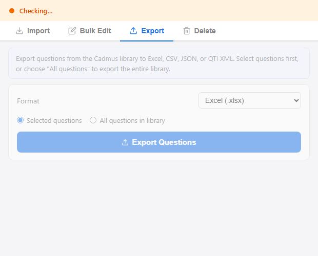

# Cadmus Question Library Tools

A Chrome extension that enhances the [Cadmus](https://cadmus.io) assessment platform with tools for managing question libraries, exporting assessments, grading audits, and comprehensive learning analytics. It works across four Cadmus pages: the **Question Library** (import, export, edit, delete), the **Assessment Edit** page (export questions as an exam-ready Word document), the **Marking** page (grade distribution, grading audits, and analysis reports), and the **Moderation** page (score distribution with adjustment overlays and full analysis suite).

---

## Table of Contents

- [Screenshots](#screenshots)
- [Installation](#installation)
- [Quick Start](#quick-start)
- [Features](#features)
  - [Import Questions](#import-questions)
  - [Column Mapping](#column-mapping)
  - [Automatic Tagging](#automatic-tagging)
  - [Duplicate Detection](#duplicate-detection)
  - [Per-Type Import](#per-type-import)
  - [Export Questions](#export-questions)
  - [Assessment Export](#assessment-export)
  - [Quick Report](#quick-report)
  - [Bulk Edit](#bulk-edit)
  - [Fix Matching Questions](#fix-matching-questions)
  - [Delete](#delete)
- [Excel Format](#excel-format)
  - [Column Reference](#column-reference)
  - [Answer Formats by Type](#answer-formats-by-type)
  - [Distractor Logic (FIB)](#distractor-logic-fib)
- [Assessment Design Rationale](#assessment-design-rationale)
- [AI-Assisted Question Generation](#ai-assisted-question-generation)
- [Development](#development)
- [File Structure](#file-structure)
- [Technical Notes](#technical-notes)
- [Author](#author)
- [License](#license)

---

## Screenshots

| Import Tab | Column Mapping |
|:---:|:---:|
|  |  |

| Export Tab | Bulk Edit Tab |
|:---:|:---:|
|  |  |

| Delete Tab |
|:---:|
|  |

---

## Installation

1. Download the latest ZIP from [**Releases**](https://github.com/Lvigentini/cadmus_plugin/releases) and extract it to your preferred location (recommended: your user folder, e.g. `~/cadmus-plugin`)
2. Open `chrome://extensions` in Chrome
3. Enable **Developer mode** (toggle in the top-right)
4. Click **Load unpacked** and select the extracted extension folder
5. Pin the extension to your toolbar for easy access

---

## Quick Start

1. Navigate to a Cadmus Question Library page
   — URL format: `https://teach.cadmus.io/{tenant}/assessment/{id}/library`
2. Click the extension icon — the status bar turns **green** when connected
3. **Import** tab:
   1. Choose an `.xlsx` or `.xml` file
   2. Verify the column mapping (auto-detected) and check which columns to use as tags
   3. Click **Apply Mapping & Parse**
   4. Expand type cards to adjust points, shuffle, similarity as needed
   5. Click **Import All Questions**
4. **Export** tab:
   1. Choose a format (Excel, CSV, JSON, or QTI XML)
   2. Select scope — "Selected questions" or "All questions in library"
   3. Click **Export Questions** — the file downloads automatically
5. **Bulk Edit** tab: select questions via the Cadmus library checkboxes → expand a type card → set options → click **Run**
6. **Delete** tab: select questions → click **Delete Selected** (confirmation required)

The log panel at the bottom shows real-time progress for all operations.

---

## Features

### Import Questions

- **Focuses on four question types**: Fill-in-Blank, MCQ, Matching, and Short Answer. Cadmus supports additional types (e.g. Numeric, Extended Response, Hotspot) — these are not yet covered and represent an area for future development
- **From Excel (.xlsx)**: reads the standard question bank format; mixed types detected automatically
- **From QTI XML (.xml)**: reads Blackboard QTI 1.2 XML exports
- **Import All**: one-click button imports every question across all detected types
- **Type-specific options**: points, shuffle, and similarity controls per type accordion card
- **FIB auto-blank detection**: `___1___`, `___2___` markers in question text are parsed automatically
- **FIB distractor cross-pollination**: wrong answers are pulled from other questions in the same file

### Column Mapping

After loading an Excel file, a mapping panel appears with:

- **Field dropdowns** for each internal field (#, Type, Question, Answers, Explanation, Bloom Level, Difficulty) — auto-detected from column headers, adjustable via dropdown
- **Sample values** from the first data row shown beside each dropdown for quick verification
- **Required fields** marked with a red asterisk — parsing will not proceed without them
- **Tag columns** — only unmapped/extra columns appear as tag checkbox candidates (columns already mapped to fields like #, Type, Question are excluded). Each candidate shows a preview of unique values from the first 5 rows

### Automatic Tagging

On import, the extension applies tags and metadata in batch:

| What | How | Example |
|------|-----|---------|
| **Tag columns** | Any unmapped column checked in the mapping panel | Topic, Source, or any custom column |
| **Bloom level** | From the Bloom Level column | `bloom-remember`, `bloom-apply`, `bloom-analyze` |
| **Difficulty** | From the Difficulty column (decorative chars stripped) | `EASY`, `MEDIUM`, `HARD` |
| **Filename** | Automatic — from the imported file's name (no extension) | `week01_mixedQs` |

Tags are applied via the `AppendTagsForQuestions` mutation (additive — never removes existing tags). Difficulty is set via `UpdateQuestionAttributes`.

### Duplicate Detection

When clicking **Import All Questions** or a per-type import button, the extension scans the existing library for potential duplicates before importing:

- **Jaccard word-overlap similarity** (70% threshold) — compares word sets between incoming and existing prompts, catching reworded questions while avoiding false positives
- **Interactive review panel** — if matches are found, shows incoming vs existing questions side-by-side with similarity percentage
- **Three actions per match**: Update existing (overwrite with new answer data), Create new (import anyway), or Skip
- **No interruption when clean** — if no duplicates are found, import proceeds directly

### Per-Type Import

Each question type card has its own import button (e.g. "Import MCQ Only") for selective importing from mixed files. Duplicate detection runs for the selected type only.

### Export Questions

Export questions from the library to seven formats — choose between **selected questions** or the **entire library**:

| Format | Extension | Use case |
|--------|-----------|----------|
| **Excel** | `.xlsx` | Re-import into another library, share with colleagues, review in a spreadsheet |
| **CSV** | `.csv` | Open in any tool, import into other LMS platforms, data analysis |
| **JSON** | `.json` | Programmatic access, backup, integration with other systems |
| **QTI 1.2 XML** | `.xml` | Round-trip: export from one Cadmus library, re-import into another via this extension |
| **Word — sorted by type** | `.docx` | Questions grouped under section headings (MCQ, Matching, FIB, Short Answer) with page breaks between sections. Full metadata, correct answers marked, explanations included |
| **Word — randomised** | `.docx` | Fisher-Yates shuffle with type badges inline. Full metadata and correct answers included |
| **Word — exam ready** | `.docx` | Randomised, clean format for student-facing use: no metadata, no correct answer markers, no explanations. Matching answers shuffled (not paired), FIB shows blanks only, short answer shows blank lines |

Each export fetches full question data via GraphQL, including prompt text, answer details, feedback, difficulty, points, tags, and shuffle settings. Word exports use the [docx](https://github.com/dolanmiu/docx) library (bundled locally) and prevent questions from splitting across pages. Progress is shown in the log panel during export.

#### Export columns (Excel and CSV)

| Column | Description |
|--------|-------------|
| `#` | Sequential index |
| `Type` | `MCQ`, `MATCHING`, `SHORT`, or `BLANKS` |
| `Question` | Full prompt text extracted from ProseMirror JSON (blanks shown as `___`) |
| `Answer / Details` | Type-specific answer formatting (see below) |
| `Explanation` | Feedback / rationale text |
| `Difficulty` | `EASY`, `MEDIUM`, or `HARD` |
| `Points` | Numeric score value |
| `Tags` | Comma-separated tag names |

#### Answer formatting by type

| Type | Format in Answer / Details column |
|------|-----------------------------------|
| **MCQ** | Lettered options with checkmark on correct: `A. Option one ✓` / `B. Option two` / `C. Option three` |
| **Matching** | Arrow-separated pairs per line: `Term → Definition` |
| **Fill-in-Blank** | Semicolon-separated accepted answers: `nephron; urine` |
| **Short Answer** | Semicolon-separated key terms: `cushioning; buoyancy` |

#### Explicit distractors

Any question type can include explicit distractors by adding a `---DISTRACTORS---` separator in the `Answer / Details` cell. Everything above the separator is treated as correct answers/pairs; everything below is added as wrong options:

```
Heart → Pumps blood
Liver → Filters toxins
Kidney → Filters blood
---DISTRACTORS---
Spleen
Appendix
Gall bladder
```

| Type | How distractors are used |
|------|--------------------------|
| **Matching** | Added as extra right-side options with no correct pairing — students see more options than prompts |
| **MCQ** | Added as additional wrong choices alongside any already parsed from above the separator |
| **FIB** | Used instead of cross-pollinated distractors from other questions in the file |
| **Short Answer** | Not applicable (no distractor concept) |

If no `---DISTRACTORS---` separator is present, existing behaviour is unchanged: FIB cross-pollinates from other questions, MCQ uses only the options listed, and matching has equal prompts and options.

#### JSON structure

The JSON export wraps questions in a metadata envelope:

```json
{
  "exportedAt": "2026-03-23T...",
  "exportVersion": "2.0",
  "source": "https://teach.cadmus.io/{tenant}/assessment/{id}/library",
  "totalQuestions": 45,
  "questions": [
    {
      "index": 1,
      "id": "uuid",
      "questionType": "MCQ",
      "prompt": "Which structure...",
      "choices": [{ "text": "Nephron", "correct": true }, ...],
      "feedback": "The nephron is...",
      "points": 1,
      "difficulty": "MEDIUM",
      "tags": ["anatomy", "bloom-apply"]
    }
  ]
}
```

#### QTI 1.2 XML round-trip

The QTI export produces Blackboard-flavoured QTI 1.2 XML that can be re-imported via the **Import** tab. MCQ questions export as `render_choice` items with scored response conditions; all other types export as `render_fib` (short response) items. Matching pairs are embedded in the prompt text using arrow notation.

### Assessment Export

The Export tab also works on **assessment edit pages** (`/task/.../edit/...`). When the plugin detects an assessment edit page, it reads questions directly from the Apollo cache — no API fetches required — and offers a single export option: **Word — exam ready**.

This produces a clean, student-facing Word document with:
- All questions from the assessment, randomised
- No metadata, correct answer markers, or explanations
- MCQ choices listed without checkmarks
- Matching prompts and answers shown as two columns (answers shuffled)
- FIB blanks shown as `___` with no answers
- Short answer questions followed by blank lines

The plugin auto-detects which Cadmus page you are on and shows only the relevant tabs:

| Page | URL pattern | Tabs shown |
|------|-------------|------------|
| **Question Library** | `/assessment/{id}/library` | Import, Bulk Edit, Export, Delete |
| **Assessment Edit** | `/assessment/{id}/task/{id}/edit/...` | Export (exam-ready Word only) |
| **Marking** | `/assessment/{id}/class/marking` | Report, Grading, Analysis |
| **Moderation** | `/assessment/{id}/grader/moderate/...` | Report, Analysis |
| **Learning Assurance** | `/assessment/{id}/learning-assurance` | Report, Analysis |

### Score Distribution Reports

The Report tab is available on the **Marking**, **Moderation**, and **Learning Assurance** pages. All grade data is read directly from the Apollo cache (instant, no DOM scraping). Two core chart types are available:

- **Mark Distribution** — per-mark bar chart coloured by Australian grade bands (F, P, CR, D, HD) with summary statistics (mean, median, min, max). On the moderation page, shows an overlaid automark-vs-adjusted distribution with separate stats for each.
- **Grade Breakdown** — grouped bars showing count and percentage per grade band. On the moderation page, shows side-by-side automark (pre-adjustment) vs final score bands.

Both charts support a **Special Consideration toggle** that splits bars side-by-side: solid colour for regular students, lighter shade for special consideration students. A **Copy chart** button copies the canvas to the clipboard as a PNG image. Max marks are auto-detected from the `WorkOutcome.maxScore` field.

### Analysis Reports

Eight analysis reports are available from the Report tab. All reports extract data from the Cadmus Apollo cache (`window.__APOLLO_CLIENT__`) and cross-reference users, enrollments, access codes, work outcomes, question outcomes, question tags, submissions, and work settings.

#### Group Comparison

A single generic report that supports multiple grouping dimensions, auto-detected from the Apollo cache data. The user selects a grouping from a dropdown; changing the selection re-renders the report immediately without reloading data.

| Grouping Dimension | Detection Criteria | Example Groups |
|---|---|---|
| **Access Code** | `Enrollment.verifiedCodes[].label` — shown when ≥2 distinct codes | Fremantle Tute 1, Sydney Tute 1, Online |
| **Exam Sitting** | `WorkSettings.examDeferred` — shown when at least one deferred student | Standard, Deferred |
| **Enrollment Tags** | `Enrollment.tags[]` — shown when ≥2 distinct tags | Special Con., Extension, etc. |
| **Submission Type** | `Submission.forceSubmitted` — shown when at least one forced | Self-submitted, Force-submitted |
| **Score Quartile** | Always available as fallback | Q1 (0–25%), Q2 (25–50%), Q3 (50–75%), Q4 (75–100%) |

For each group: n, mean %, median %, SD, min, max. Groups deviating >1 SD from the cohort mean are flagged. A grouped bar chart shows grade band distribution (F → HD) per group.

#### Learning Assurance

| Report | Description | Data Sources |
|--------|-------------|--------------|
| **Cognitive Complexity** | Performance heatmap by cognitive level (remember → create). Colour-coded cells: green (≥70%), yellow (50–70%), red (<50%). Bar chart of mean % correct per level. | `QuestionTag` (bloom levels), `QuestionOutcome.scoreBreakdown` |
| **Topic / Week** | Performance by curriculum topic or week number. Shows question counts, point totals, question types, and mean/median/SD per topic. | `QuestionTag` (week/topic labels), `QuestionOutcome.scoreBreakdown` |
| **Difficulty Analysis** | Validates tagged difficulty (EASY/MEDIUM/HARD) against actual student performance. Flags mismatches (e.g., "EASY" questions with <60% mean). Reference threshold lines on chart. | `Question.difficulty`, `QuestionOutcome.scoreBreakdown` |
| **Question Type** | Breakdown by question format (MCQ, BLANKS, SHORT, MATCHING). Shows question count, total points, weight contribution, and performance stats. | `Question.questionType`, `Question.points`, `QuestionOutcome.scoreBreakdown` |

#### Exam Integrity & Marking Quality

| Report | Description | Data Sources |
|--------|-------------|--------------|
| **Exam Timing** | Histogram of actual exam duration (5-min buckets). Writing time limit shown as reference line. Stacked bars for submitted vs force-submitted. Flags students using <50% of allocated time or force-submitted. | `Work.startDate`, `Submission.submittedAt`, `Submission.forceSubmitted`, `AssessmentSettings.examWritingTime` |
| **Automark Analysis** | Distribution of marker adjustments (markerModifier) per student. Per-question-type breakdown showing automark mean, adjustment mean/SD/range, and direction (markers add/reduce/neutral). Histogram coloured by positive/negative adjustment. | `WorkOutcome.scoreBreakdown`, `QuestionOutcome.scoreBreakdown` |

#### Data Model

All analysis reports share a common data extraction and model-building pipeline:

1. **`loadAnalysisData()`** — executes in the page context (`world: 'MAIN'`) to read the Apollo cache. Extracts slim versions of 14 entity types (User, Enrollment, AccessCode, WorkOutcome, QuestionOutcome, Question, QuestionTag, Work, Submission, WorkSettings, AssessmentSettings, etc.).
2. **`buildAnalysisModel(raw)`** — runs in the popup context. Builds relationship maps (user→enrollment→work→outcome→question) and computes derived fields: tute group membership, deferred status, exam duration, Bloom's level, week/topic tags, difficulty validation.
3. **Individual renderers** — each report function receives the processed model and renders a combination of HTML tables (`analysis-table` class) and canvas-based charts. All charts include a "Copy chart" button.

### Bulk Edit

Select questions using the checkboxes in the Cadmus library table, then:

- **MCQ** — set points and shuffle choices
- **Matching** — set points and shuffle pairs
- **Short Answer** — set points and similarity threshold (auto-marking)

### Fix Matching Questions

A repair tool in the **Bulk Edit → Matching** card that fixes matching questions with broken data structures. It detects old-format questions (where `sourceSet`/`targetSet` were inverted) and rebuilds them with the correct Cadmus data model:

- `sourceSet` = answers (right side), identifiers: `right_1`, `right_2`, ...
- `targetSet` = prompts (left side), identifiers: `left_1`, `left_2`, ...
- `correctValues` = `["left_1 right_1", "left_2 right_2", ...]`

Works on selected questions or all matching questions in the library. Safe to run multiple times — skips questions that already use the correct model.

### Delete

Archive selected questions in bulk. This uses the archive mutation and is **irreversible** from the Cadmus UI.

---

## Excel Format

> **Sample file**: [`docs/sample-question-bank.xlsx`](docs/sample-question-bank.xlsx) — 9 questions (2 FIB, 3 MCQ, 2 Matching, 2 Short Answer) with a mix of Bloom levels, difficulties, and topics. Use it to test the import flow or as a template for your own question banks.

Columns can appear in any order — the Column Mapping UI auto-detects headers by name and lets you reassign them if needed.

### Column Reference

| Header | Required | Description |
|--------|:--------:|-------------|
| `#` | ✓ | Row number / question ID |
| `Type` | ✓ | `MCQ`, `Fill in the Blank`, `Matching`, or `Short Answer` |
| `Question` | ✓ | Question text (FIB uses `___1___`, `___2___` blank markers) |
| `Answer / Details` | ✓ | Answers — format varies by type (see below) |
| `Explanation` | | Feedback shown after answering |
| `Bloom Level` | | Cognitive level → auto-tagged as `bloom-[value]` |
| `Difficulty` | | `● Easy` / `●● Medium` / `●●● Hard` → normalised to enum |
| `Topic` | | Tag string — applied when checked in mapping panel |
| `source_file` | | Source filename — applied when checked in mapping panel |

### Answer Formats by Type

**Fill-in-Blank**
- Semicolons separate accepted answers: `nephron; urine`
- For multi-blank questions, the pool is split across blanks using ceiling division (e.g. 6 answers for 2 blanks → 3 per blank)

**Multiple Choice**
- Newline- or semicolon-separated choices (whichever yields more options)
- Correct answer marked with `*` prefix, `✓`/`✔` suffix, or falls back to last choice
- Leading `A.` / `B.` / `C.` labels are stripped automatically

**Matching**
- Newline-separated pairs using `→` or `->` as separator
- Example: `Heart → Thoracic cavity (mediastinum)`

**Short Answer**
- Semicolon-separated accepted answer keywords: `cushioning; buoyancy; nutrient transport`

### Distractor Logic (FIB)

Each fill-in-blank automatically gets **2 distractors** (wrong answers) pulled from other questions in the same file:

1. Prefer answers from the **same blank position** in other questions
2. Fall back to answers from **any blank position** if needed
3. Case-insensitive deduplication prevents duplicate choices
4. Distractors are randomly shuffled for variety

---

## Assessment Design Rationale

The defaults used by the import system and the AI prompt templates — three MCQ options, 4–6 matching pairs, user-specified question counts, Bloom-level tagging — are grounded in educational measurement research. A dedicated document explains the evidence behind each design choice:

> **📄 [`docs/assessment-design-rationale.md`](docs/assessment-design-rationale.md)** — covers MCQ option count (Rodriguez, 2005), distractor quality (Haladyna et al., 2002), FIB cloze design, matching pair guidelines, short answer auto-marking, Bloom alignment (Anderson & Krathwohl, 2001), and difficulty calibration.

This document is intended for question authors, instructional designers, and anyone configuring or extending the import pipeline — whether manually or via the agentic workflow below.

---

## AI-Assisted Question Generation

Three prompt templates are provided in `docs/ai-prompts/` for generating question banks in the correct Excel format using different AI tools. Each template applies the defaults documented in the [Assessment Design Rationale](docs/assessment-design-rationale.md):

| File | Use with | Description |
|------|----------|-------------|
| [`claude-skill.md`](docs/ai-prompts/claude-skill.md) | Claude (skill) | A structured Claude skill that can be loaded into Claude Code or Claude Projects |
| [`prompt-openai-gemini.md`](docs/ai-prompts/prompt-openai-gemini.md) | ChatGPT, Gemini | A self-contained system prompt for OpenAI or Google models |
| [`agentic-pipeline.md`](docs/ai-prompts/agentic-pipeline.md) | OpenClaw, LangGraph, CrewAI | An agentic pipeline definition with roles, tools, and workflow stages |

Each template includes the full column specification, answer format rules per question type, Bloom taxonomy levels, and example rows. See the individual files for usage instructions.

---

## Development

After making changes to the source files:

1. Go to `chrome://extensions`
2. Click the **refresh** icon on the extension card
3. Re-open the popup — changes take effect immediately (no reinstall needed)

---

## File Structure

```
├── manifest.json          # Chrome extension manifest (v3)
├── background.js          # Service worker — opens popup as centred window
├── popup.html             # Extension popup UI
├── popup.css              # Popup styles
├── popup.js               # Main logic: parsers, UI wiring, injected actions
├── lib/
│   ├── xlsx.mini.min.js   # SheetJS library for browser-side Excel parsing
│   └── docx.min.js        # docx library (dolanmiu/docx) for Word document generation
├── icons/
│   ├── icon16.png         # Toolbar icon
│   ├── icon48.png         # Extensions page icon
│   └── icon128.png        # Web Store / install dialog icon
└── docs/
    ├── assessment-design-rationale.md
    ├── sample-question-bank.xlsx
    ├── ai-prompts/
    │   ├── claude-skill.md
    │   ├── prompt-openai-gemini.md
    │   └── agentic-pipeline.md
    ├── screenshot-import-tab.png
    ├── screenshot-column-mapping.png
    ├── screenshot-bulk-edit-tab.png
    ├── screenshot-export-tab.png
    └── screenshot-delete-tab.png
```

---

## Technical Notes

- **Manifest V3** — modern Chrome extension format
- **Page-context injection** — scripts run in `world: 'MAIN'` to access Cadmus React/Apollo internals
- **GraphQL API** — communicates with `https://api.cadmus.io/cadmus/api/graphql`
- **React Fiber traversal** — extracts TanStack table state for selected-row detection
- **SheetJS** — bundled locally for browser-side Excel parsing and export (no CDN dependency)
- **docx** — [dolanmiu/docx](https://github.com/dolanmiu/docx) v9.6.1, bundled locally for Word document generation with `keepNext` pagination control
- **Multi-format export** — Excel via SheetJS, Word via docx, CSV/JSON/QTI XML via string builders; all formats use Blob + hidden anchor download
- **Apollo cache extraction** — assessment edit pages have fully hydrated question data in the Apollo cache; the plugin reads it directly without API fetches
- **Context-aware UI** — detects library, marking, and assessment edit pages via strict URL matching anchored to `cadmus.io/{tenant}/assessment/{id}/...`; source tab ID stored in session storage for correct detection when popup opens as a separate window
- **Matching data model** — Cadmus uses an inverted naming convention: `sourceSet` = answers (right side, `right_N`), `targetSet` = prompts (left side, `left_N`), `correctValues` = `"left_N right_N"` pairs
- **Duplicate detection** — Jaccard word-overlap similarity (70% threshold) against TanStack table data; no extra API calls for the scan

---

## Author

**Lorenzo Vigentini** — [lorenzo@cogentixai.com](mailto:lorenzo@cogentixai.com)

This project was proudly co-authored with AI. **Claude** (Anthropic) contributed as a development partner throughout, assisting with code review and quality assurance, UI/UX design recommendations, security checking of GraphQL mutations and injected scripts, documentation structure and technical writing, and assessment design rationale grounded in educational measurement literature.

## License

MIT
