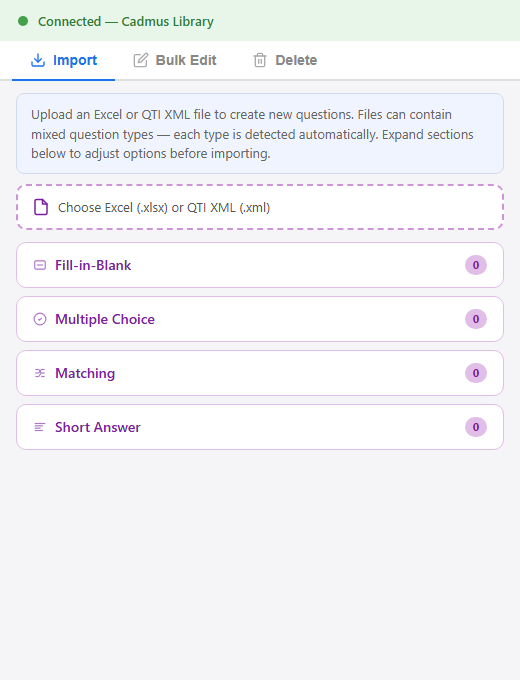
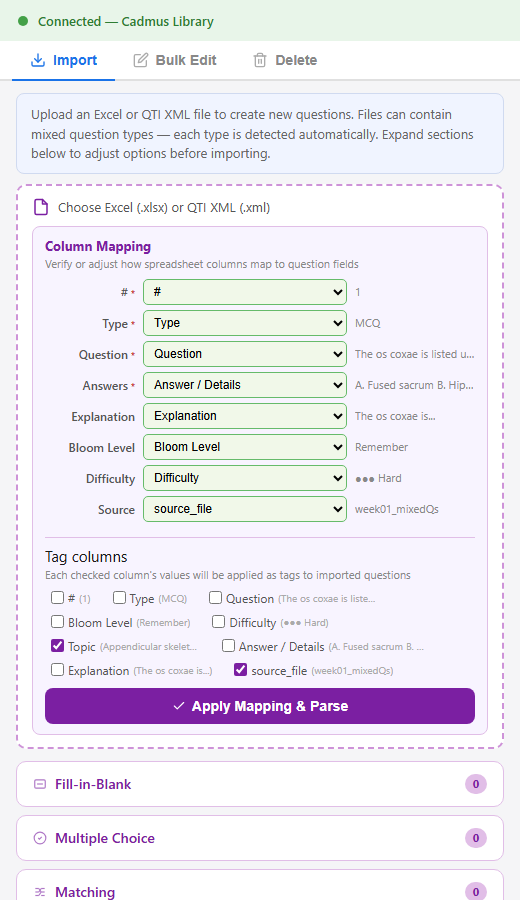
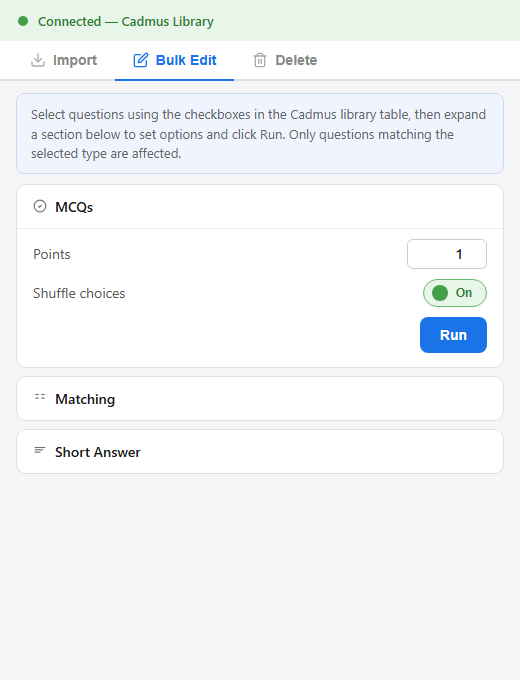
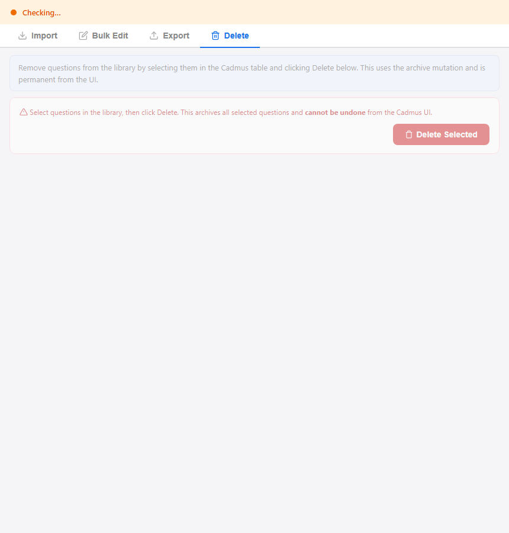

# Cadmus Question Library Tools

A Chrome extension that enhances the [Cadmus](https://cadmus.io) question library interface with streamlined bulk import from Excel and QTI XML, flexible column mapping, automatic tagging (topic, Bloom level, difficulty, filename), and batch editing of points, shuffle, and similarity settings across selected questions.

---

## Table of Contents

- [Screenshots](#screenshots)
- [Installation](#installation)
- [Quick Start](#quick-start)
- [Features](#features)
  - [Import Questions](#import-questions)
  - [Column Mapping](#column-mapping)
  - [Automatic Tagging](#automatic-tagging)
  - [Bulk Edit](#bulk-edit)
  - [Delete](#delete)
- [Excel Format](#excel-format)
  - [Column Reference](#column-reference)
  - [Answer Formats by Type](#answer-formats-by-type)
  - [Distractor Logic (FIB)](#distractor-logic-fib)
- [AI-Assisted Question Generation](#ai-assisted-question-generation)
- [Development](#development)
- [File Structure](#file-structure)
- [Technical Notes](#technical-notes)
- [Author](#author)
- [License](#license)

---

## Screenshots

| Import Tab | Column Mapping |
|:---:|:---:|
|  |  |

| Bulk Edit Tab | Delete Tab |
|:---:|:---:|
|  |  |

---

## Installation

1. Clone or download this repository
2. Open `chrome://extensions` in Chrome
3. Enable **Developer mode** (toggle in the top-right)
4. Click **Load unpacked** and select the extension folder
5. Pin the extension to your toolbar for easy access

---

## Quick Start

1. Navigate to a Cadmus Question Library page
   — URL format: `https://teach.cadmus.io/{tenant}/assessment/{id}/library`
2. Click the extension icon — the status bar turns **green** when connected
3. **Import** tab:
   1. Choose an `.xlsx` or `.xml` file
   2. Verify the column mapping (auto-detected) and check which columns to use as tags
   3. Click **Apply Mapping & Parse**
   4. Expand type cards to adjust points, shuffle, similarity as needed
   5. Click **Import All Questions**
4. **Bulk Edit** tab: select questions via the Cadmus library checkboxes → expand a type card → set options → click **Run**
5. **Delete** tab: select questions → click **Delete Selected** (confirmation required)

The log panel at the bottom shows real-time progress for all operations.

---

## Features

### Import Questions

- **Four question types**: Fill-in-Blank, MCQ, Matching, Short Answer
- **From Excel (.xlsx)**: reads the standard question bank format; mixed types detected automatically
- **From QTI XML (.xml)**: reads Blackboard QTI 1.2 XML exports
- **Import All**: one-click button imports every question across all detected types
- **Type-specific options**: points, shuffle, and similarity controls per type accordion card
- **FIB auto-blank detection**: `___1___`, `___2___` markers in question text are parsed automatically
- **FIB distractor cross-pollination**: wrong answers are pulled from other questions in the same file

### Column Mapping

After loading an Excel file, a mapping panel appears with:

- **Field dropdowns** for each internal field (#, Type, Question, Answers, Explanation, Bloom Level, Difficulty, Source) — auto-detected from column headers, adjustable via dropdown
- **Sample values** from the first data row shown beside each dropdown for quick verification
- **Required fields** marked with a red asterisk — parsing will not proceed without them

### Automatic Tagging

On import, the extension applies tags and metadata in batch:

| What | How | Example |
|------|-----|---------|
| **Tag columns** | Any column checked in the mapping panel | Topic, Source, or any custom column |
| **Bloom level** | From the Bloom Level column | `bloom-remember`, `bloom-apply`, `bloom-analyze` |
| **Difficulty** | From the Difficulty column (decorative chars stripped) | `EASY`, `MEDIUM`, `HARD` |
| **Filename** | From the imported file's name | `week01_mixedQs` |

Tags are applied via the `AppendTagsForQuestions` mutation (additive — never removes existing tags). Difficulty is set via `UpdateQuestionAttributes`.

### Bulk Edit

Select questions using the checkboxes in the Cadmus library table, then:

- **MCQ** — set points and shuffle choices
- **Matching** — set points and shuffle pairs
- **Short Answer** — set points and similarity threshold (auto-marking)

### Delete

Archive selected questions in bulk. This uses the archive mutation and is **irreversible** from the Cadmus UI.

---

## Excel Format

> **Sample file**: [`docs/sample-question-bank.xlsx`](docs/sample-question-bank.xlsx) — 9 questions (2 FIB, 3 MCQ, 2 Matching, 2 Short Answer) with a mix of Bloom levels, difficulties, and topics. Use it to test the import flow or as a template for your own question banks.

Columns can appear in any order — the Column Mapping UI auto-detects headers by name and lets you reassign them if needed.

### Column Reference

| Header | Required | Description |
|--------|:--------:|-------------|
| `#` | ✓ | Row number / question ID |
| `Type` | ✓ | `MCQ`, `Fill in the Blank`, `Matching`, or `Short Answer` |
| `Question` | ✓ | Question text (FIB uses `___1___`, `___2___` blank markers) |
| `Answer / Details` | ✓ | Answers — format varies by type (see below) |
| `Explanation` | | Feedback shown after answering |
| `Bloom Level` | | Cognitive level → auto-tagged as `bloom-[value]` |
| `Difficulty` | | `● Easy` / `●● Medium` / `●●● Hard` → normalised to enum |
| `Topic` | | Tag string — applied when checked in mapping panel |
| `source_file` | | Source filename — applied when checked in mapping panel |

### Answer Formats by Type

**Fill-in-Blank**
- Semicolons separate accepted answers: `nephron; urine`
- For multi-blank questions, the pool is split across blanks using ceiling division (e.g. 6 answers for 2 blanks → 3 per blank)

**Multiple Choice**
- Newline- or semicolon-separated choices (whichever yields more options)
- Correct answer marked with `*` prefix, `✓`/`✔` suffix, or falls back to last choice
- Leading `A.` / `B.` / `C.` labels are stripped automatically

**Matching**
- Newline-separated pairs using `→` or `->` as separator
- Example: `Heart → Thoracic cavity (mediastinum)`

**Short Answer**
- Semicolon-separated accepted answer keywords: `cushioning; buoyancy; nutrient transport`

### Distractor Logic (FIB)

Each fill-in-blank automatically gets **2 distractors** (wrong answers) pulled from other questions in the same file:

1. Prefer answers from the **same blank position** in other questions
2. Fall back to answers from **any blank position** if needed
3. Case-insensitive deduplication prevents duplicate choices
4. Distractors are randomly shuffled for variety

---

## AI-Assisted Question Generation

Three prompt templates are provided in `docs/ai-prompts/` for generating question banks in the correct Excel format using different AI tools:

| File | Use with | Description |
|------|----------|-------------|
| [`claude-skill.md`](docs/ai-prompts/claude-skill.md) | Claude (skill) | A structured Claude skill that can be loaded into Claude Code or Claude Projects |
| [`prompt-openai-gemini.md`](docs/ai-prompts/prompt-openai-gemini.md) | ChatGPT, Gemini | A self-contained system prompt for OpenAI or Google models |
| [`agentic-pipeline.md`](docs/ai-prompts/agentic-pipeline.md) | OpenClaw, LangGraph, CrewAI | An agentic pipeline definition with roles, tools, and workflow stages |

Each template includes the full column specification, answer format rules per question type, Bloom taxonomy levels, and example rows. See the individual files for usage instructions.

---

## Development

After making changes to the source files:

1. Go to `chrome://extensions`
2. Click the **refresh** icon on the extension card
3. Re-open the popup — changes take effect immediately (no reinstall needed)

---

## File Structure

```
├── manifest.json          # Chrome extension manifest (v3)
├── background.js          # Service worker — opens popup as centred window
├── popup.html             # Extension popup UI
├── popup.css              # Popup styles
├── popup.js               # Main logic: parsers, UI wiring, injected actions
├── lib/
│   └── xlsx.mini.min.js   # SheetJS library for browser-side Excel parsing
├── icons/
│   ├── icon16.png         # Toolbar icon
│   ├── icon48.png         # Extensions page icon
│   └── icon128.png        # Web Store / install dialog icon
└── docs/
    ├── sample-question-bank.xlsx
    ├── ai-prompts/
    │   ├── claude-skill.md
    │   ├── prompt-openai-gemini.md
    │   └── agentic-pipeline.md
    ├── screenshot-import-tab.png
    ├── screenshot-column-mapping.png
    ├── screenshot-bulk-edit-tab.png
    └── screenshot-delete-tab.png
```

---

## Technical Notes

- **Manifest V3** — modern Chrome extension format
- **Page-context injection** — scripts run in `world: 'MAIN'` to access Cadmus React/Apollo internals
- **GraphQL API** — communicates with `https://api.cadmus.io/cadmus/api/graphql`
- **React Fiber traversal** — extracts TanStack table state for selected-row detection
- **SheetJS** — bundled locally for browser-side Excel parsing (no CDN dependency)

---

## Author

**Lorenzo Vigentini** — [lorenzo@cogentixai.com](mailto:lorenzo@cogentixai.com)

## License

MIT
